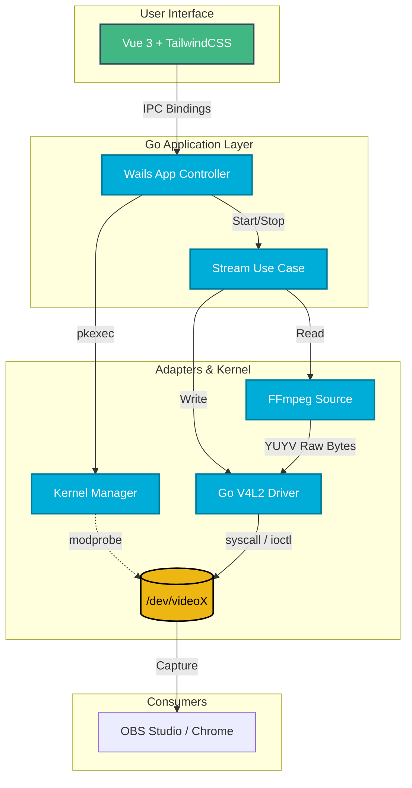

# LoopCam Manager

O **LoopCam Manager** é uma aplicação desktop nativa para Linux projetada para gerenciar múltiplas câmeras virtuais simultâneas. Focada em desenvolvedores, streamers e testadores de QA, a ferramenta permite criar instâncias de dispositivos V4L2 dinamicamente e injetar arquivos de vídeo (`.mp4`) em loop infinito diretamente no Kernel, simulando webcams físicas de alta fidelidade para uso em softwares como OBS Studio, Google Meet ou qualquer navegador web (via WebRTC).

## 🧩 Arquitetura e Funcionamento

O projeto foi construído sob rigorosos princípios de **Clean Architecture** e **Domain-Driven Design (DDD)**. O Core da aplicação (Golang) não possui acoplamento direto com o sistema operacional ou a interface gráfica. O fluxo de I/O é tratado em nível de infraestrutura, onde o Go se comunica diretamente com o Kernel Linux via chamadas de sistema (`ioctl`), enviando bytes puros de vídeo (YUYV) para os descritores de arquivo, o que garante um consumo de CPU extremamente otimizado em relação a decodificadores tradicionais.



## 🐧 Ambiente e Dependências (Ubuntu / Linux)

Este projeto foi arquitetado primariamente para **Ubuntu 24.04 LTS** (e derivados Debian), interagindo profundamente com o subsistema de vídeo do Linux (Video4Linux2). 

Para que o orquestrador consiga instanciar os dispositivos no Kernel e decodificar os vídeos, o seu sistema operacional **deve** possuir as seguintes dependências instaladas:

```bash
sudo apt update
sudo apt install v4l2loopback-dkms ffmpeg policykit-1
```

* **`v4l2loopback-dkms`**: Módulo de Kernel que permite a criação das interfaces `/dev/video*` (Câmeras Virtuais).
* **`ffmpeg`**: Utilizado em background como Adapter para extração frame-a-frame no ritmo nativo do vídeo (`-re`).
* **`policykit-1` (`pkexec`)**: Utilizado para elevação segura de privilégios temporários apenas durante a configuração inicial do Kernel, mantendo a aplicação rodando em modo seguro (User-Space).

## ✨ Funcionalidades

* **Alocação Dinâmica:** Solicita permissão e cria de 1 a 10 câmeras virtuais isoladas simultaneamente no sistema.
* **Boundary Protection (Udev Race Fix):** Proteção inteligente contra condições de corrida do Kernel e leituras precipitadas do WebKitGTK.
* **Graceful Fallback:** Recuperação funcional caso descritores de arquivo fiquem presos por ciclos de vida de outras aplicações.
* **Compatibilidade WebRTC:** Injeção da flag `exclusive_caps=1`, garantindo que navegadores modernos reconheçam o dispositivo nativamente como uma Webcam física.
* **Processamento Concorrente:** Cada câmera virtual roda em sua própria *Goroutine* com contextos de cancelamento independentes.

## 🛠️ Tech Stack & Práticas de Engenharia

Este projeto é uma demonstração prática de padrões de engenharia de software:

* **Backend:** Go (Golang), Wails v2.
* **Frontend:** Vue.js 3, TypeScript (Strict Mode), TailwindCSS v4.
* **Padrões de Código:**
    * *Clean Architecture* (Domain, Application, Infra).
    * *Functional Error Handling* (Retornos explícitos, tratamento de Syscalls).
    * *Object Calisthenics* (No Else, Early Returns, Small Files).

## 🚀 Como Rodar e Desenvolver

1.  Clone o repositório:
    ```bash
    git clone https://github.com/luizhanauer/loopcam-manager.git
    cd loopcam-manager
    ```
2.  Garanta que você tem o Wails CLI instalado (`go install github.com/wailsapp/wails/v2/cmd/wails@latest`).
3.  Inicie o ambiente de desenvolvimento (A flag WebKit contorna conflitos de CGO com GTK no Ubuntu 24.04):
    ```bash
    wails dev -tags webkit2_41
    ```

Para compilar o binário final:
```bash
wails build -tags webkit2_41 -platform linux/amd64
```

## 📝 Regras de Uso (Workflow)

Para garantir que o Kernel Linux aceite o seu vídeo, siga o fluxo de integridade do V4L2:
1. Abra o LoopCam Manager.
2. Atribua o arquivo `.mp4` à câmera virtual e clique em **Iniciar Transmissão**.
3. **Somente após o streaming iniciar no LoopCam**, abra a câmera no OBS Studio ou no navegador.

Contribuição
------------

Contribuições são bem-vindas! Se você encontrar algum problema ou tiver sugestões para melhorar a aplicação, sinta-se à vontade para abrir uma issue ou enviar um pull request.

Se você gostou do meu trabalho e quer me agradecer, você pode me pagar um café :)

<a href="https://www.paypal.com/donate/?hosted_button_id=SFR785YEYHC4E" target="_blank"></a>


Licença
-------

Este projeto está licenciado sob a Licença MIT. Consulte o arquivo LICENSE para obter mais informações.

---
Desenvolvido por **Luiz Hanauer**.